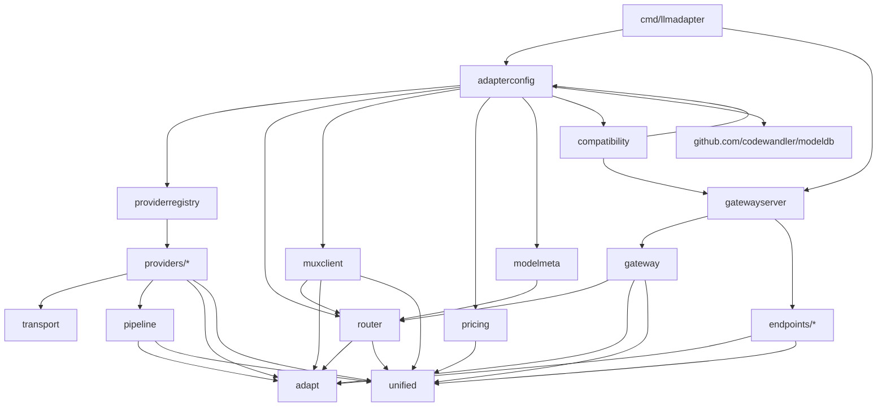

# Architecture

This document describes the current `llmadapter` architecture, package boundaries, dependency shape, known shortcomings, and roadmap for hardening the design.

`DESIGN.md` remains the long-form target design. `PLAN.md` records implementation history and the release-candidate roadmap. `docs/API_SURFACE.md` records the v1 public package boundary. This document is the practical architecture review of the code as it exists now.

## Purpose

`llmadapter` adapts requests between downstream API compatibility surfaces and upstream provider API surfaces through a canonical request/event model.

The core design avoids direct `M x N` conversions between every endpoint and every provider:

```text
downstream endpoint wire API
  -> adapt.Request
  -> unified.Request / unified.Event stream
  -> provider endpoint wire API
```

The same stateless routing path is used by:

- HTTP compatibility gateway endpoints.
- The Cobra CLI.
- The in-process mux client for library consumers.
- Live e2e smoke tests.

Conversation/session state intentionally lives above this repository, for example in `agentsdk`.

## Package Layers

### Core Model

`unified` defines the canonical request, messages, content parts, tools, response formats, usage/cost accounting, extension bag, event stream, `unified.Client`, and `Collect`.

`adapt` defines API kind/family identifiers, strict/best-effort mapping concepts, endpoint/provider request envelopes, warnings, and generic codec/processor interfaces.

These packages should stay small, provider-neutral, and free of concrete provider imports.

### Stream And Transport

`pipeline` contains generic event/request processors used to transform or enrich streams, including pricing processors.

`transport` contains byte-stream transport primitives, HTTP request execution, fake transports for tests, SSE/NDJSON parsing, retry/rate-limit wrappers, and extended compression support.

Providers may depend on `pipeline` and `transport`. Higher-level routing should not depend on provider wire details.

### Provider Clients

`providers/*` packages implement upstream provider endpoint clients that satisfy `unified.Client`.

Current provider endpoint families include:

- Anthropic Messages-compatible: `anthropic`, `claude`, `openrouter_messages`, `minimax_messages`.
- OpenAI Chat-compatible: `openai_chat`, `openrouter_chat`, `minimax_chat`.
- OpenAI Responses-compatible: `openai_responses`, `openrouter_responses`, `codex_responses`.

Provider endpoint packages own provider-specific wire request encoding, streaming response decoding, auth behavior, and provider-specific request extensions.

Shared wire structs that are used on both sides of the adapter live outside provider implementation packages. Anthropic Messages wire types are in `anthropicwire`; the upstream Anthropic provider keeps aliases for compatibility, while the downstream `/v1/messages` endpoint imports the neutral wire package.

### Endpoint Codecs

`endpoints/*` packages implement downstream HTTP compatibility surfaces:

- `/v1/chat/completions`
- `/v1/responses`
- `/v1/messages`

Each endpoint decodes inbound HTTP requests into `adapt.Request`, then encodes canonical `unified.Event` streams back into the downstream API wire format.

Endpoint codecs should not own provider selection or provider credentials.

### Routing

`router` defines:

- `ProviderEndpoint`: provider name, exact API kind, API family, client, capabilities, priority, and tags.
- `Route`: selected provider endpoint plus public/native model mapping.
- `StaticRouter`: deterministic routing by source API, model, required capabilities, route weight, endpoint priority, and declaration order.

Routing is intentionally endpoint-based:

```text
Provider = who we talk to.
API kind = exact upstream wire protocol.
API family = compatibility shape.
Provider endpoint = provider + API kind + family + client + capabilities.
```

This matters for providers such as OpenRouter, MiniMax, Azure, Bedrock, Vertex, or Ollama, where one provider can expose multiple protocol surfaces.

### Gateway

`gateway` contains the generic HTTP handler that:

1. Decodes a downstream request through an endpoint codec.
2. Asks the router for route candidates.
3. Rewrites the request model to the selected native model.
4. Calls the selected provider endpoint client.
5. Writes canonical events through the endpoint codec.
6. Falls back to lower-ranked candidates when a provider fails before response bytes are written.
7. Tracks temporary provider endpoint/model health.

`gatewayserver` wires the three implemented HTTP endpoints to a shared router built from `adapterconfig`.

### Config And Construction

`adapterconfig` is the main construction boundary. It loads and validates JSON/env config, builds provider endpoints through `providerregistry`, loads the modeldb catalog with overlays, resolves requested models against catalog offerings, applies modeldb metadata and pricing wrappers, builds routers, and constructs the in-process mux client.

`providerregistry` lists supported provider endpoint descriptors and builds direct provider clients for a configured provider type.

`muxclient` exposes a stateless `unified.Client` over the same router/provider endpoint path used by the gateway.

`examples/llmadapter.example.json` is a load-tested operator config that exercises this construction boundary without requiring provider credentials during inspection.

### Metadata And Pricing

`modelmeta` maps modeldb offering exposure metadata into route capabilities and limits.

Model resolution is centralized in `adapterconfig`. CLI diagnostics, `llmadapter infer`, auto route summaries, mux routing, and gateway routing use the same catalog-backed route/native-model decision. Modeldb is the source of truth for whether a model or alias exists when modeldb-backed routing is enabled; dynamic routes reject catalog-missing models instead of falling through to provider defaults. Config inspection and model resolution expose capability provenance as `provider_descriptor`, `config_override`, or `modeldb_exposure`.

`pricing` enriches canonical usage events with modeldb-backed cost items.

`compatibility` evaluates route candidates against workload profiles such as `agentic_coding` and `summarization`. It consumes candidates produced by `adapterconfig`; it does not perform a separate modeldb lookup or instantiate providers.

Modeldb is metadata and pricing input. It must not secretly instantiate providers or own credentials.

## Dependency Diagram



## Request Flow

### HTTP Gateway Flow

```text
HTTP request
  -> endpoint DecodeHTTP
  -> adapt.Request
  -> router candidates
  -> selected provider endpoint
  -> native model rewrite
  -> provider unified.Client
  -> unified.Event stream
  -> endpoint WriteEvents
  -> HTTP response
```

### In-Process Mux Flow

```text
unified.Request
  -> muxclient
  -> adapt.Request with optional source API
  -> router candidates
  -> selected provider endpoint
  -> native model rewrite
  -> provider unified.Client
  -> unified.RouteEvent + provider unified.Event stream
```

When the mux client source API is empty, routing is in auto-source mode: all configured source routes are eligible, and the router ranks higher-weight routes first, then source-native Anthropic Messages routes before OpenAI Responses and Chat routes. Compatibility gateways still pass an explicit source API derived from the inbound HTTP endpoint.

### Provider Flow

```text
unified.Request
  -> provider request mapping
  -> provider wire HTTP request
  -> transport byte stream
  -> provider wire event decoder
  -> unified.Event stream
```

## Current Strengths

- The core request/event model is provider-neutral and stream-first.
- Provider routing targets provider endpoints, not just provider names.
- OpenRouter and MiniMax are represented as providers with multiple API kinds/families instead of being collapsed into one pseudo-kind.
- The gateway and mux client share the same router/provider endpoint model.
- Library mux clients can leave source API unset to let routing choose the best provider endpoint for a model alias; compatibility gateways still route from an explicit inbound API kind.
- Modeldb integration is explicit: fixed routes can resolve aliases, narrow capabilities, attach limits, and enrich costs; known dynamic model requests can narrow capabilities and price per requested native model.
- Shared HTTP transport normalizes non-2xx provider responses into `unified.APIError`, including status, JSON error fields, raw provider body, and `Retry-After` hints.
- Mid-stream provider errors are projected as `unified.ErrorEvent` carrying `unified.APIError` where the provider exposes structured error fields. Gateway/mux fallback remains pre-stream/pre-response only; once streaming output begins, errors surface to the caller instead of retrying another provider.
- Provider raw error payloads are preserved for normalized non-2xx errors and covered mid-stream error events, including Responses response-object failures.
- Multimodal support is explicit and warning-driven: supported image URL/base64 inputs encode through compatible provider surfaces, while unsupported audio/file/video parts are either rejected in strict mode or dropped with `unsupported_field_dropped` warnings in best-effort mode.
- Built-in tool support is explicit by omission: unmodeled provider-native tools such as web search or code interpreter are warning/dropped in current endpoint/provider paths instead of being silently forwarded as malformed function tools.
- Prompt-cache primitives are explicit on `unified.Request`: policy/key/TTL intent is mapped by provider codecs, while session-level cache strategy and stable-prefix projection stay in agentsdk.
- Provider-specific controls are carried through namespaced `unified.Request.Extensions` instead of being added as core fields too early.
- Reasoning stream projection is fixture-tested across Anthropic-family Messages surfaces, OpenAI Responses-compatible surfaces, and Codex Responses. `unified.Collect` preserves reasoning signatures, citations, and raw provider events for higher layers that need continuation or provider-specific metadata.
- Citation projection is fixture-tested for Responses-family output annotations and Anthropic-family text-block citations; canonical citations retain URL/title/text/ranges/document IDs and unknown citation metadata where available.
- Endpoint codecs preserve HTTP/raw decode metadata for diagnostics, and compatible endpoints project canonical citations back into provider-shaped response annotation/citation fields.
- Provider metadata preservation is fixture-tested for raw usage payloads and unmapped provider stream events across OpenAI Chat, Responses-family, Codex Responses, and Anthropic-family Messages surfaces.
- `cmd/llmadapter-gateway` is now a thin compatibility binary over the shared `adapterconfig` and `gatewayserver` path.
- Live smoke tests cover text, tools, tool-result continuation, reasoning streams, prompt-cache accounting where providers report cache counters, and gateway paths across supported providers. `docs/PROVIDER_MATRIX.md` records the exact v1 provider endpoint matrix and latest live result.

## Known Shortcomings

### Static Provider Registry

`providerregistry` is intentionally static. Descriptors carry endpoint metadata and factories, so metadata and construction stay together without a central provider-type switch. This is stable for v1, but it is not a plugin system. External provider module loading remains post-v1 expansion.

### Shared Wire Packages

Shared wire structs that cross endpoint/provider boundaries should live in neutral packages. Anthropic Messages already follows this through `anthropicwire`. New shared wire packages should be added only when there is real cross-boundary reuse, not preemptively.

### Gateway/Mux Fallback Boundary

Gateway and mux client both implement route candidate fallback. Shared route-attempt mechanics live in `internal/routeattempt`: candidate lookup, native model rewrite, and provider/API error formatting.

The shared policy classifies request-shape validation failures as non-retryable, including `adapt.UnsupportedFieldError` and 400/422 provider API errors. Gateway config can set `max_attempts`; mux library consumers can set `muxclient.WithMaxAttempts`. The HTTP-specific response-start rule stays in `gateway`: once response bytes are written, the gateway cannot transparently retry another upstream.

### Capability Provenance

Base capabilities are still partly endpoint-family/provider defaults. Modeldb narrows fixed-route capabilities and known dynamic model requests, and dynamic model IDs missing from the catalog are rejected instead of being rewritten to provider defaults. CLI/config inspection reports where effective capabilities came from:

- `provider_descriptor`: static provider endpoint metadata.
- `config_override`: explicit operator override in llmadapter config.
- `modeldb_exposure`: modeldb offering exposure metadata for the selected provider API.

### Conformance Depth

Live tests are strong smoke coverage, and deterministic offline fixtures cover the currently known compatibility classes: endpoint decode edge cases, reasoning variants, citation metadata variants, provider error shapes, raw/unmapped events, prompt-cache accounting where exposed, and unsupported-media/built-in-tool policy. Remaining conformance gaps are future-facing:

- Additional reasoning/citation variants as providers expose new event shapes.
- Additional provider-specific error body and mid-stream error variants as providers evolve.
- Actual audio, video, file, document, and built-in tool support if those features are added beyond the current warning/drop policy.
- Broader provider-specific extension semantic validation for controls that are still intentionally raw.

### Raw Event Preservation

Raw/unmapped event preservation exists for provider usage payloads and selected unmapped provider stream events. More provider-specific events should be preserved before broadening to APIs with richer event streams.

### Current Stable State

The current stable state is a stateless, stream-first adapter with shared `adapterconfig` construction for CLI, gateway, and mux client paths. Model resolution is centralized through modeldb catalog loading plus alias overlays when modeldb-backed routing is enabled. Provider support spans Anthropic Messages-compatible, OpenAI Chat-compatible, and OpenAI Responses-compatible endpoint families across Anthropic, Claude Code-compatible access, OpenAI, OpenRouter, MiniMax, and Codex endpoint variants.

Usage/cost accounting is canonical and structured, provider raw usage/error payloads are retained where exposed, prompt-cache controls are explicit request hints, and stateful conversation/session behavior remains outside llmadapter.

### Stateful Conversation Policy

Stateful conversations intentionally live outside llmadapter. This is the right boundary, but llmadapter must continue exposing the stateless primitives that agentsdk needs: previous response IDs, prompt cache keys, response IDs, provider session hints, usage, and cost events.

## Improvement Roadmap

### 1. Keep Provider Registry Static And Descriptor-Owned

Provider descriptors now carry static client factories, so client construction lives with descriptor metadata instead of in a growing provider-type switch. This remains static and deterministic for v1; a plugin-style registry is not required.

### 2. Normalize Shared Wire Packages Where Needed

Only extract shared wire packages when there is real duplication or cross-boundary coupling. Anthropic Messages has been extracted to `anthropicwire` because both downstream `/v1/messages` and upstream Anthropic-compatible providers use the same wire shape.

### 3. Align Gateway And Mux Fallback Policy

Keep the HTTP-specific response-start behavior in `gateway`, but factor shared route attempt/error metadata where useful so mux and gateway report failures consistently.

Initial shared mechanics are implemented in `internal/routeattempt`: candidate lookup, native model rewrite, error formatting, retryability classification, and max-attempt checks. Remaining policy expansion, if needed, is post-v1 work such as backoff or richer production failure classification.

### 4. Broaden Codec Conformance

Focused offline fixture tests now cover the known v1 classes. Future work should add fixtures as providers expose new event shapes, error bodies, citation annotations, cache accounting details, or supported media/tool types.

### 5. Validate Provider Extensions

Keep extension data namespaced, but add typed helper structs and validation for mature extension groups such as:

- OpenRouter provider/routing/plugin/debug controls. Initial typed raw helpers are implemented through `unified.OpenRouterExtensions`.
- OpenAI Responses continuation/cache controls. Initial typed helpers are implemented through `unified.OpenAIResponsesExtensions`.
- Codex-specific session/window/turn controls. Initial typed helpers are implemented through `unified.CodexExtensions`.
- Anthropic-family beta/thinking/cache controls. Initial beta helpers are implemented through `unified.AnthropicExtensions`.

Typed extension readers now validate mature extension groups and return `invalid_extension_dropped` warnings for invalid values. Focused semantic checks cover OpenAI Responses cache retention, OpenRouter routing/provider/plugin/session controls, Anthropic beta header values, and Codex turn metadata. Provider encoders preserve valid extensions and drop invalid controls instead of silently sending malformed provider-specific fields.

### 6. Keep Conversation State Out Of Core

Do not move replay history, durable session state, cache policy, or memory projection into llmadapter. Instead, keep improving the stateless primitives consumed by agentsdk and similar clients.

## Design Rules Going Forward

- New providers should register provider endpoints, not just provider names.
- New API surfaces should get distinct `adapt.ApiKind` values when their wire shape or event semantics differ.
- Shared compatibility should be expressed through `adapt.ApiFamily`.
- Provider-specific request knobs should start as namespaced extensions unless they are truly canonical across multiple families.
- Modeldb may select metadata, aliases, limits, capabilities, and pricing. It must not instantiate providers or hide credentials.
- The CLI, gateway, mux client, and tests should keep using the same `adapterconfig` construction path.
- Conversation/session behavior belongs above `unified.Client`, not inside the gateway/router.
